# IVR DSL Compiler

IVR DSL Compiler 是一个解析交互式语音应答（Interactive Voice Response，IVR）领域特定语言，并将其编译成 Java 代码的工具。运行 Compiler 工具，既可以编译一个以 IVR
语法编写的代码文件，也可以直接在命令行中输入单行 IVR 代码，并实时查看当下 IVR 程序的逻辑结构。

------

<!-- TOC -->

- [IVR DSL Compiler](#ivr-dsl-compiler)
    - [项目使用](#项目使用)
    - [脚本语法](#脚本语法)
        - [init](#init)
        - [add](#add)
        - [remove](#remove)
        - [status](#status)
        - [export](#export)
        - [config](#config)
        - [help](#help)
        - [示例程序](#示例程序)
    - [运行 IVR 程序](#运行-ivr-程序)
    - [数据结构设计](#数据结构设计)
        - [事件树](#事件树)
        - [事件节点](#事件节点)
        - [枚举](#枚举)
        - [语法解析](#语法解析)
        - [其他数据结构](#其他数据结构)
    - [项目结构](#项目结构)
    - [项目测试](#项目测试)
    - [接口文档](#接口文档)

<!-- /TOC -->

------

## 项目使用

IVR DSL Compiler 是在 Idea 编写的项目，并使用 maven 框架维护依赖。因此运行项目时也推荐在 Idea 下打开。

在 Idea 创建项目时选择 `Get from Version Control`，并输入项目的 url 可以直接将项目从 GitLab 中克隆下来，Idea 会自动加载 maven
并安装需要的依赖。在后台进程全部运行结束后，找到 `src/main/java/priv/ivrdsl/Application.java` 中的 `main` 接口即可直接运行。

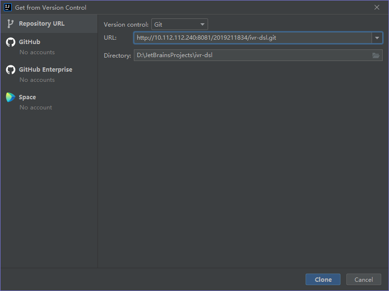

`Application` 提供了两种运行方式：

* 无参数直接运行程序，Compiler 会把命令行作为输入流，在其中逐行输入 IVR 代码以逐步构建 IVR 程序。
* 运行时添加参数，Compiler 会将参数的第一个字符串视为 IVR 脚本的存储路径，并根据该路径解析 IVR 脚本。如果脚本中有输出语句的话，可以在相关的位置找到输出。

项目包含了一个示例，IVR 脚本位于测试文件夹下：`src/test/resources/test.ivr` 。为 `Application` 添加参数 `src/test/resources/test.ivr`
即可运行文件解析。解析的结果包括两个位置：

* 文件夹 `src/main/java/priv/ivrdsl` 中会生成 `VoiceMenu.java` 程序，可以直接在项目中运行、调试 IVR 程序。
* 项目文件夹下会生成 `release` 文件夹（如果该文件夹原先不存在的话），其中包含 `VoiceMenu.java` 程序和一个由所有项目代码和依赖打包成的 `jar` 包。将 `VoiceMenu.java`
  复制到其他项目中，并引入 `jar` 包，就可以在其他项目中运行 IVR 程序。

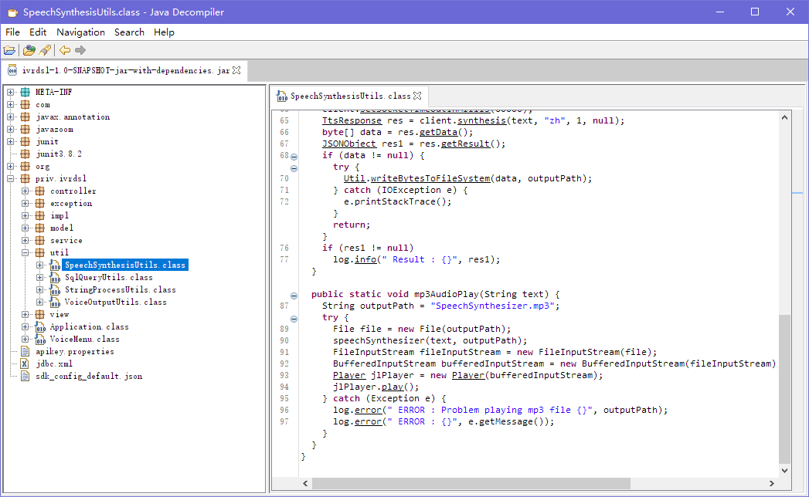

------

## 脚本语法

IVR 领域特定语言是一种类似命令行语法的语言，主要结构为 `<main class> [command] [command options]` 形式，大小写不敏感，其中 `[command]` 可接受 7
种输入，以分别执行不同的操作。`[command option]` 的分隔符为 `=`，`option=value` ，等号两边不能有空格。如果 `value` 中含有空格，需要将 `option=value` 整体用双引号 `""`
包括起来，如 `"-path=C:\JetBrains Projects\ivr dsl"`。

### init

`init` 语句初始化一个 IVR 脚本。该语句只能出现在 IVR DSL 的开头，一个 Compiler 进程下如果已经初始化过了 IVR 脚本，再接收到 `init` 语句时，会抛出错误，中止解析进程。

`init` 语句的语法为：

   ```shell
Usage: init [options]
  Options:
    -playback
      IVR 程序的欢迎语音
      Default: 欢迎致电Voice Menu
    -title
      IVR 程序的标题
      Default: Voice Menu
   ```

`init` 支持两个参数，分别为 `-playback` （欢迎语音）和 `-title` （接通电话时显示的标题），均可以省略。若某个参数省略，则 Compiler 会使用其默认值，这里就是 `欢迎致电Voice Menu`
和 `Voice Menu`。因此一个合法的 `init` 语句可以是：

   ```shell
init
INIT -PLAYBACK=欢迎致电申国移动
init "-title=China Mobile" -playback=欢迎致电申国移动
   ```

（**注**：由于 JFrame 中输出中文字符导致乱码的问题尚未解决，`-title` 中输入中文会造成乱码，建议这里使用英文。）

### add

`add` 语句向 IVR 脚本中添加一个事件，并指定触发该事件时执行的动作，其语法为：

   ```shell
Usage: add [options] 触发该事件的按键
  Options:
    * -action
      事件触发时执行的动作
    -additions
      部分动作所需的补充信息
      Default: []
    * -event
      事件名称
   ```

其中 `-action` 和 `-event` 参数为必选参数，如果在 `add` 语句中没有设置该参数，Compiler 进程会中止并抛出错误。“触发该事件的按键”为 `add` 语句的主参数，语句中没有 `[option]`
修饰的 `value` 即被认为是“触发该事件的按键”参数，同样为必选参数。

根据 IVR 常见的用途，`add` 语句对 `-action` 和按键可以接受的值做出了限定，其中按键值仅支持电话上的 12 个键：1，2，3，4，5，6，7，8，9，0，#，*，而 `-action` 支持的动作值及其含义则如下表：

|      | ACTION | 含义                                                         |
| ---- | ------ | ------------------------------------------------------------ |
| 1    | back   | 返回上级菜单（不可以在主菜单下使用）                         |
| 2    | call   | 转接服务（通过 `-additions` 配置转接对象，触发时会播放语音“正在为您转接xxx”） |
| 3    | info   | 信息查询服务（通过 `-additions` 配置查询数据表，触发时会在指定的表中查询需要的数据） |
| 4    | hangup | 结束通话                                                     |
| 5    | manual | 转接人工服务                                                 |
| 6    | menu   | 创建菜单（客户触发该事件后进入次级菜单，为客户提供下一级的服务选项列表） |
| 7    | record | 录音（如不在人工服务时段，可以让客户将需求通过录音保存下来） |
| 8    | replay | 重听（重播当前菜单的选项列表）                               |

`-action` 的值同样是大小写不敏感的，`back` 和 `Back` 都被认为是返回动作 `ACTION_BACK` 。但忽略大小写后仍不在该列表下的动作是不被接受的，会在编译时抛出错误。

如表中所见，`-additions` 参数只有在动作为 `info` 和 `call` 时才有用，其他情况下包含 `-additions` 参数不会报错，但也不会有效果。而 `info` 和 `call`
中也可以没有 `-additions` 参数，不过这可能会导致运行 IVR 程序时出现不希望发生的错误，如数据表不存在等。

一个合法的 `add` 语句可以是：

```shell
add 1 -event=转接业务部门 -action=call -additions=业务部门
add 1 -event=转接业务部门 -action=call
add 2 -event=信息业务 -action=info -additions=tbData
add 3 -event=请挂机 -action=hangup
add -event=请挂机 -action=hangup 3
ADD -event=选择业务 -action=MENU #
```

### remove

`remove` 语句删除一个事件（如果存在的话）或者一个事件树（如果该事件触发的动作是 `menu`）。用法为：

```shell
Usage: remove [options] 事件逻辑路径
```

其中事件逻辑路径设计到 IVR 事件树的概念，具体请参考 [事件树：trigger-event 映射](#事件树)

因为 Compiler 将根节点的路径视为 `"0"` 而不是 `""`，所以要执行删除操作时，路径至少应当是长度为 2 的字符串。

如果删除的是 `menu` 动作的事件，则会将其下的次级菜单（以及可能的第三层菜单等）内的事件全部递归删除，这里不会有提示，因此建议在使用[ **`status`** ](#status)命令查看事件树后再执行删除。

一个合法的 `remove` 语句可以是：

```shell
remove 0#
remove 0*59
```

### status

`status` 语句不需要参数，用以查看当前事件的逻辑树。

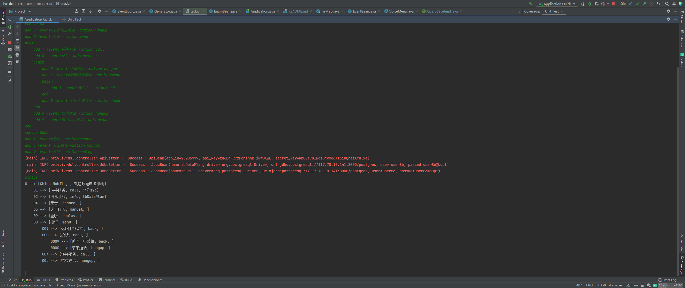

### export

`export` 语句结束编译，并将当前的 IVR 逻辑转化成 Java 程序。其支持一个参数，含义为导出程序的存放路径，是 `export` 语句的主参数，不需要 `[command option]`：

```shell
Usage: export [options] 项目导出路径
```

如果没有指定导出路径，则会在项目文件夹下创建一个名为 `release` 的文件夹（如果文件夹不存在的话），随后在其中生成一个表达 IVR 逻辑的 Java 程序 `VoiceMenu.java`
和运行程序需要的依赖包 `ivrdsl-1.0.0-jar-with-dependencies.jar`。若指定路径，则会在路径下创建 `release` 文件夹，并在其中包含上述的两个文件。

在其他项目中导入 `jar` 包后， `VoiceMenu.java` 就可以在那个项目中运行。

`export` 还有一个隐藏的可接受的参数 `--debug`，为布尔型参数，不需要设定 `[value]`。选择 `--debug` 参数后，Compiler 会在本项目内部生成 `VoiceMenu.java`
，它可以直接编译运行。`--debug` 选项会忽略导出路径设置，不会生成 `release` 文件夹，不过 `jar` 包依然可以通过 `mvn clean && mvn package` 生成。该参数选项主要可用于调试。

一个合法的 `export` 语句可以是：

```shell
export
export ""
export "C:\JetBrains Projects"
export --debug
```

### config

`config` 语句设置 IVR 运行时需要的配置。配置包括两个部分：

* 语音合成 API：IVR 所需的语音合成，本项目使用了百度语音技术提供的 API。因此要正确运行 IVR，就需要在百度智能云平台注册并申请语音合成的
  API。具体技术文档请参考[百度智能云 - 语音合成](https://cloud.baidu.com/doc/SPEECH/s/yk38y8h3j)。`config` 语句提供了三个相关的参数 `-appid`，`
  -apikey` 和 `-secretkey` ，它们都可以在百度智能云平台的控制台中获取。
* 数据库配置：`add` 语句中支持的事件之一 `info` ，需要从数据库中查询需要的用户数据。因此对于一个查询事件，IVR 程序需要得到数据库的待查表格名、数据库驱动名、url、登录用户名、登录密码五项配置，`config`
  语句提供了 `-name`，`-driver`，`-url`，`-user`，`-passwd` 五个参数用以分别配置

```sh
Usage: config [options]
  Options:
    -apikey
      语音合成 apikey
    -appid
      语音合成 appid
    -driver
      数据库驱动
    -passwd, -password
      访问数据库的密码
    -secretkey
      语音合成 secretkey
    -name, -table
      数据库连接 待查关系表名
    -url
      数据库 url
    -user
      访问数据库的用户名
```

`-appid`，`apikey`，`secretkey` 三个配置项，每一个 IVR 程序只有一个，因此每次输入都会将之前的设置覆盖，导出前尚未设置的配置项会被设置成空串 `""`。

`-name`，`-driver`，`-url`，`-user`，`-passwd` 五个配置项具有依赖关系，一旦一个 `config`
语句中包括了这五个参数中的几个，但并不全包括的话，编译器会报错。一组配置可以设置一组数据库查询的信息，由于实际业务可能会需要对多个表做不同的查询，所以可以通过执行多条 `config` 语句来配置多个数据库连接。`-name`
参数值如果在之前已经出现过，则这一组配置将会覆盖先前同表的配置数据。

`-name` 参数也可替换成 `-table`，`-passwd` 参数也可替换成 `-password`。

API 和数据库配置分别生成于 `src/main/resources/apikey.properties` 和 `src/main/resources/jdbc.xml`
，有需要时也可以手动修改。导出后配置文件就不可更改，需要更改配置需要重新编译 IVR 脚本。

一个合法的 `config` 语句可以是：

```bash
config -appid=25286979 -apikey=zQ6BhKR7zPchzhhRTikw0lwL -secretkey=RbOGe7GINgzOjvXg6fz3iUQrailYdlxe
config -table=tbDataPlan -driver=org.postgresql.Driver -url=jdbc:postgresql://117.78.10.141:8000/postgres -user=user86 -passwd=user86@bupt
config -appid=25286979
config -appid=25286979 -name=tbDataPlan -driver=org.postgresql.Driver -url=jdbc:postgresql://117.78.10.141:8000/postgres -user=user86 -password=user86@bupt
```

### help

显示帮助。主要用于命令行逐行输入 IVR 脚本时使用。在其他命令后添加参数 `-help`，`-h`，`?` 也同样可以在命令行显示帮助。

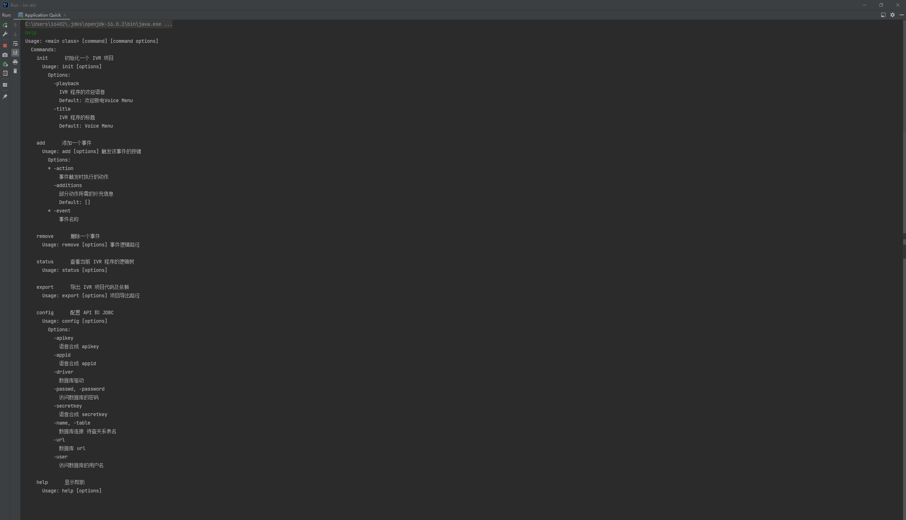

一个合法的 `help` 语句可以是：

```shell
help
add -h
remove ?
```

### 示例程序

IVR 脚本：**[test.ivr](./src/test/resources/test.ivr)**

生成程序：**[VoiceMenu.java](./src/main/java/priv/ivrdsl/VoiceMenu.java)**

------

## 运行 IVR 程序

IVR DSL Compiler 生成的 `VoiceMenu.java` 中为用户留下了一个接口方法 `queryCase`，它的类型为使用 `@FunctionalInterface`
注解的接口类 [**`QueryCaseImpl`**](./src/main/java/priv/ivrdsl/impl/QueryCaseImpl.java)。该接口用于配置数据库查询的条件。

举个例子，某个 IVR 程序根据用户的手机号码查询用户流量套餐和话费账单，这两个信息可以来自两个不同的查询业务，也就是不同的两个 `info` 动作，但条件一般都是一样的，也就是：

```java
QueryCaseImpl queryCase = () ->
        "where phone_number = getUserPhoneNumber()";
```

也有的程序可能需要监听用户电话键盘上的按键输入，如考生查成绩需要在电话键盘上输入准考证号，这时候 `queryCase` 就可以被设计为：

```java
QueryCaseImpl queryCase = () ->
        "where id = actionListened(ActionEvent event)";
```

这里的方法 `getUserPhoneNumber()`，`actionListened(ActionEvent event)` 可以来自第三方，或者由用户自己编写。

IVR DSL Compiler 默认 `queryCase` 返回的是空串 `""`，即无条件，最终查询到的结果将是表中的第一行。

IVR 程序执行的实际查询语句为

```sql
select * from "$tableName" $queryCase
```

`$tableName` 就是 `info` 动作参数 `additions` 设置的表名，由双引号引起，因此需要注意表名的大小写；而 `$queryCase` 则是由 `queryCase()`
方法确定。查询将表的第一列作为客户称呼，而第二列往后作为查询信息输出，因此在数据 ETL 时也应当注意不要在被查询表格中引入不需要的列项。

------

## 数据结构设计

### 事件树

IVR 的业务逻辑呈现为树状，具体表现为以初始状态“0”为树的根节点，每一个 `event` 都是“0”的子节点。如果一个 `event` 的 `action` 是 `menu`，则意味着在该事件节点下存在另一组子节点。它们组成了 IVR
业务的一个次级菜单，在客户按下 `menu` 对应的按键后进入。而如果 `action` 不是 `menu`，那么这个 `event` 就已经成为了叶子结点。

对于这个逻辑树，我们令根节点的绝对路径为“0”。用户通过按键到达一个事件节点，则这个事件节点相对根节点的路径就是用户按键的顺序。因此可以将每一个事件节点的绝对路径表示为 `"0" + 用户到达该节点的按键顺序`。

因此在 Compiler
中设计有一个数据结构 [**`IvrMap`**](./src/main/java/priv/ivrdsl/model/IvrMap.java)，其中的一个成员变量为 `Map<String, List<String>>`
类型的 HashMap ，用以记录每一个事件节点绝对路径和事件信息（包括事件 `event`，动作 `action` 和补充信息 `additions`）的映射关系，我们称之为 **trigger-event映射**），以此表示 IVR
脚本的业务逻辑。

### 事件节点

一个事件由事件名（需符合 Java 命名规则）、语音播放中使用的事件名、触发按键、子事件集合、可能需要的补充信息、触发动作、事件结束后的处理这样一组变量就可以完全描述。

其中事件名和语音播放事件名之间一一对应，可以由一个哈希表 `event2VoiceTextMap` 表达。而事件名与其他几项共同描述一个事件，我们可以将其组成一个 `JavaBean`
，即 [**`EventBean`**](./src/main/java/priv/ivrdsl/model/EventBean.java)。

### 枚举

动作 `action` ，按键 `button` 和命令 `command`
都存在一个可选的范围，因此分别为它们设计了枚举类，全部存放在类 [**`EnumBean`**](./src/main/java/priv/ivrdsl/model/EnumBean.java)
内。并由于 `valueOf` 不可重载，另外设计了一个 `getByCode` 方法完成由字符串查找枚举值的工作。

### 语法解析

语法解析使用了 `JCommander` 提供的接口，将 DSL
设计成类似命令行命令的格式，以便调用接口完成解析。所有语句的解析工作都在 [**`Commands`**](./src/main/java/priv/ivrdsl/model/Commands.java)
类中完成。

### 其他数据结构

一个事件下属子事件的按键集合 `List<String> possibleOptionList` ，事件对象名与按键路径的映射表 `HashMap<String, EventBean> event2TriggerMap`
，事件对象名与语音输出名称的映射表 `HashMap<String, String> event2VoiceTextMap` ，这些变量贯穿于整个 IVR 运行过程，且考虑到每一个 IVR 进程只需要一个，所以设置成 `static`
的全局静态变量，提供给整个程序使用，它们存放在 [**`GlobalVariableBean`**](./src/main/java/priv/ivrdsl/model/GlobalVariableBean.java)
中

------

## 项目结构

IVR DSL Compiler 大致上分为四个层次

| 分层       | 涉及文件夹                                                   | 作用                                      |
| ---------- | ------------------------------------------------------------ | ----------------------------------------- |
| 终端显示层 | [priv.ivrdsl.view](./src/main/java/priv/ivrdsl/view)         | 配置 IVR 程序的 UI 界面                   |
| Service层  | [priv.ivrdsl.service](./src/main/java/priv/ivrdsl/service)   | 实现 IVR 解析，脚本运行逻辑等具体业务需求 |
| Manager层  | [priv.ivrdsl.controller](./src/main/java/priv/ivrdsl/controller) | 处理配置文件，数据库查询等通用业务需求    |
|            | [priv.ivrdsl.util](./src/main/java/priv/ivrdsl/util)         | 为Service层提供工具类                     |
| Model层    | [priv.ivrdsl.model](./src/main/java/priv/ivrdsl/model)       | 项目数据结构                              |
|            | [priv.ivrdsl.impl](./src/main/java/priv/ivrdsl/impl)         | 项目接口                                  |
|            | [priv.ivrdsl.exception](./src/main/java/priv/ivrdsl/exception) | 项目自定义异常类型                        |

而文件夹中每个类的具体作用，请参考[ Javadoc ](#接口文档)文档。

------

## 项目测试

项目为IVR DSL Compiler 的 Service 层，Manager 层和 Model 层的方法做了单元测试，包括预期异常测试和各工具类的测试，共有 18 个测试方法， 64 个测试案例。

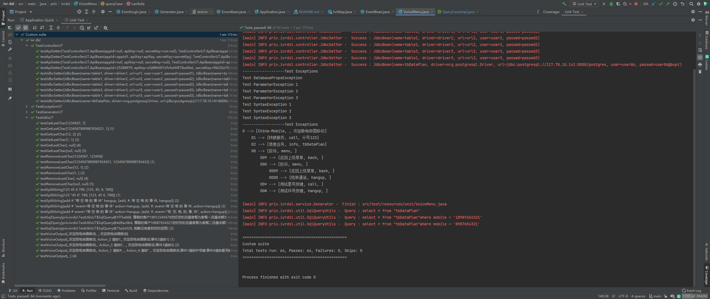

排除掉 `priv.ivrdsl.view` 包，接口类 `Application` ，`export --debug` 生成的结果 `VoiceMenu` 以及 IVR 脚本程序才会用到的 `EventBean`
和 `EventLogic` 类后，测试代码覆盖 83% 的类，77% 的代码行，对项目中创建的方法完成了基本的测试。

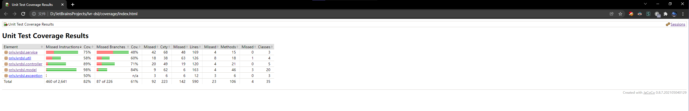


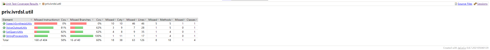

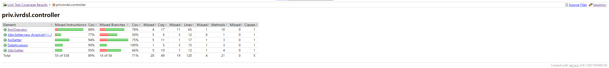

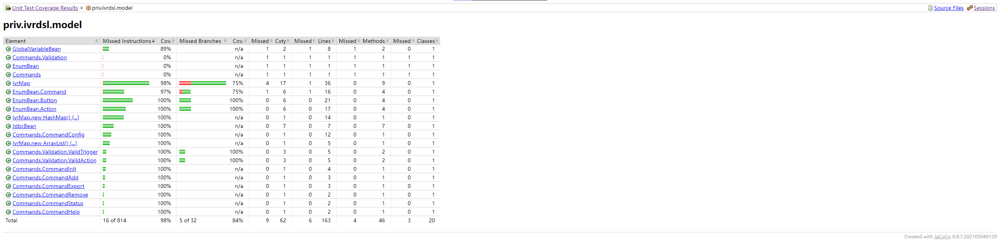

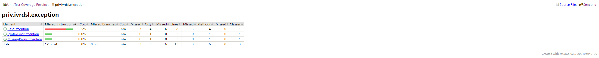

完整的覆盖率报告：[**coverage**](./coverage/index.html)

------

## 接口文档

通过以下命令生成 Javadoc 文档：

```shell
mvn clean -f pom.xml
mvn compile -f pom.xml
mvn lombok:delombok -f pom.xml
mvn javadoc:javadoc -f pom.xml
```

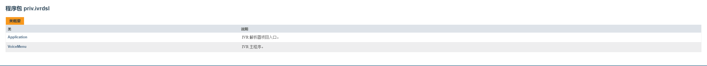

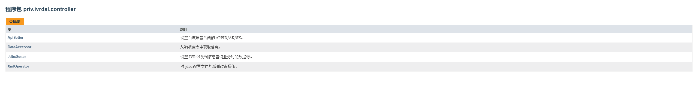

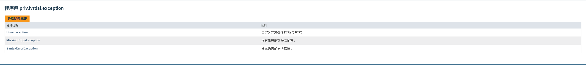

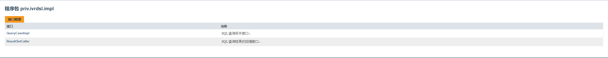

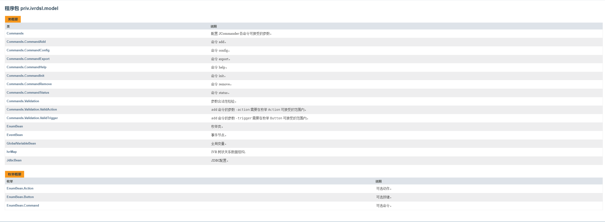

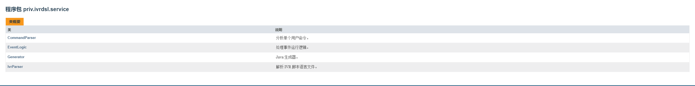

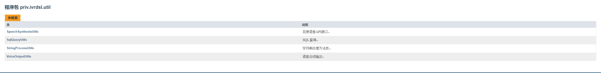

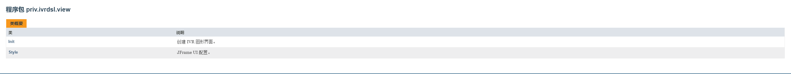


完整的 Javadoc 文档：[**apidocs**](./apidocs/index.html)